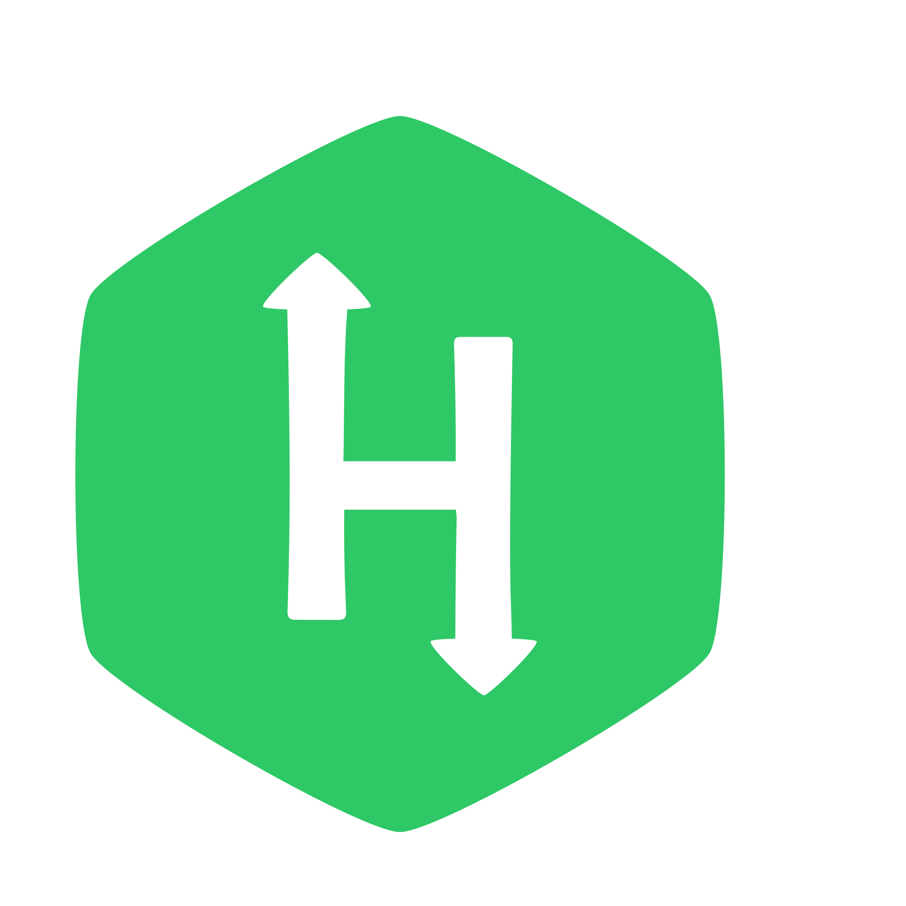

## You can reach all of them by using the url on side
Image | URL
----- | ---
       | https://raw.githubusercontent.com/KaanBN/profile-icons/main/Twitter.svg
  | https://raw.githubusercontent.com/KaanBN/profile-icons/main/android.svg
          | https://raw.githubusercontent.com/KaanBN/profile-icons/main/c.svg
          | https://raw.githubusercontent.com/KaanBN/profile-icons/main/flutter.svg
          | https://raw.githubusercontent.com/KaanBN/profile-icons/main/hacker-rank.svg
          | https://raw.githubusercontent.com/KaanBN/profile-icons/main/laravel.svg
          | https://raw.githubusercontent.com/KaanBN/profile-icons/main/leetcode.svg
          | https://raw.githubusercontent.com/KaanBN/profile-icons/main/medium.svg
          | https://raw.githubusercontent.com/KaanBN/profile-icons/main/php.svg
          | https://raw.githubusercontent.com/KaanBN/profile-icons/main/postman.svg
          | https://raw.githubusercontent.com/KaanBN/profile-icons/main/python.svg
          | https://raw.githubusercontent.com/KaanBN/profile-icons/main/selenium.svg
          | https://raw.githubusercontent.com/KaanBN/profile-icons/main/stack-overflow.svg
          | https://raw.githubusercontent.com/KaanBN/profile-icons/main/steam.svg
